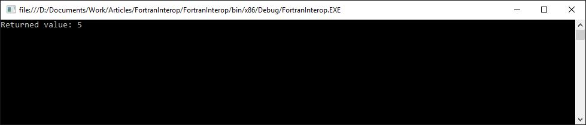
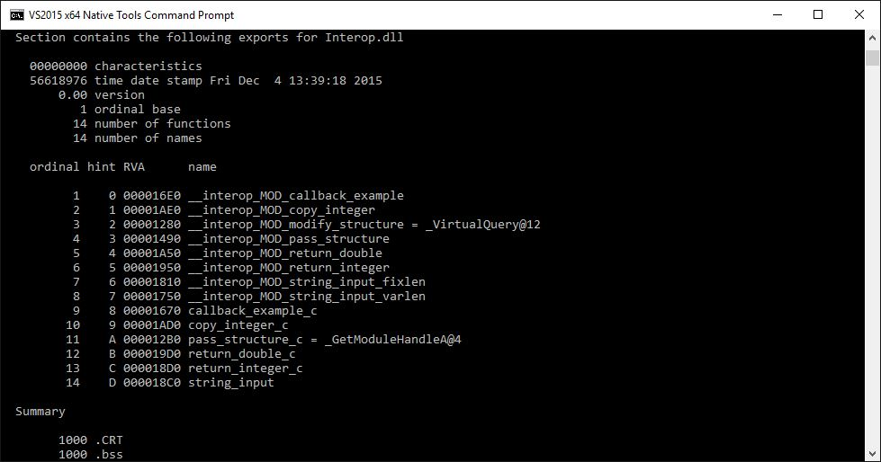

# Introduction to FORTRAN Interoperability with .NET

An introduction to the strange world of mixed language programming with FORTRAN and C# .NET code

Fortran (formerly FORTRAN) is one of those languages most programmers probably will never get to use. Fortran is almost surely older than you are and was initially written on paper punch cards which were used to control computers the size of mammoths which had less processing power than your digital watch. While Fortran was designed in the mid 50s by IBM, it did not not go extinct like the mammoth. Fortran is in fact still widely used for numerical computations and there is a large amount of exiting code written in Fortran. While Fortran surely won’t power your fancy MVC web framework with NoSQL database, you are likely to bump into it when working at some organization which is involved in engineering or science. Think aerospace, mechanical engineering, defense, space and astronomy.

So what is it with Fortran besides that there may be a large existing code base hidden away in the basements of large organizations, and why should I even care? Well, the latest Fortran version actually dates from 2008 and a new one is scheduled for release in 2016. Fortran excels in solving numerical problems and is by many considered a fairly ‘safe’ language to work with because it has strong checks at compile time. This makes it immune to problems like buffer overflows in many cases.

Fortran however is not the language to use to build a graphical user interface, generate HTML code or consume and publish web services. So how would one be able to make use of Fortran’s merits while still being able to use the right tool for job for all the other aspects of modern programming? The solution is in interoperability between different languages, also referred to as mixed language programming.

This series aims to introduce some of the concepts of mixed language programming and to serve as an examples for those who are interested.

1. [Introduction to FORTRAN interopability with .NET](introduction.md)
1. [Exchanging complex data](complex-data.md)
1. [ISO C Binding module](iso-c-binding.md)
1. Callbacks and strings
1. Mixed mode assemblies

## Interoperability with C# .NET

So how does one accomplish this interoperability (or interop for short) between different languages? This series will explain what is involved in making Fortran and C# code running on the .NET framework interoperate. It is assumed that the main program is running on .NET framework; the C# code will call the Fortran code. Callbacks may be involved, but the native Fortran code will never invoke any C# code by itself.

### Calling Conventions in Fortan

In order to make two languages work together nicely, one of the primary things to figure out is the calling convention. The calling convention specifies how arguments and return values are passed between function calls.

For Fortran, there is no prescribed calling convention and it is thus up to the designers of the compiler to pick one. Most modern Fortran compilers seem to use a calling convention known as `stdcall`. In the `stdcall` calling convention, the callee (function being called) is responsible for cleaning up the stack. Stdcall is widely used, but plain C code for example uses a different calling convention, known as `cdecl`. The only real way to know for sure is to check the compiler documentation or to explicitly enforce a calling convention.

We will later see that the .NET framework allows one to specify which calling convention to use when invoking native code, not unlike how one can specify the calling convention on C/C++ functions.

More information on calling conventions can be found at https://en.wikipedia.org/wiki/X86_calling_conventions.

### Value Passing and Data Types

The next important thing to figure out is how parameters are passed between functions and which data types correspond between the two languages. First, we’ll look at how parameters are passed.

Fortran by default assumes that all arguments are passed by reference. This means that when an argument is passed to a function, only the address of the memory location where the value is stored is transferred on the stack. In the .NET framework, so called primitive types (which includes types like integers, doubles, characters, etc.) are passed by value while all class instances are passed by reference.

The difference in how .NET primitives are passed and how Fortran expects arguments to be passed is an important one and must be kept in mind. Forgetting about these differences can cause the stack to be corrupted and will lead to undefined values being received.

### Linking Fortran as Shared Library

In order to be able to link Fortran code as a shared library, the Fortran code needs to be linked as a shared library. This is something you'll not see that often in Fortran; Fortran modules are generally compiler to object files which are in the end statically linked forming one single executable containing all the code. I think it goes without saying that when mixing .NET and Fortran, the latter approach may be a bit of a challenge.

Luckily most Fortran compiler suites support linking Fortran code to a shared library fairly easily. One key issue I encountered is that sometimes extra compiler commands must be passed to make sure that the compiled code does not assumed fixed memory addresses. This is important as the Fortran code will be loaded into the memory space of some other process where the exact memory location cannot be guaranteed before hand.

### Naming Conventions and Name Mangling

When linking a library as a shared library, the different functions that are included in the library are ‘exported’. This basically entails creating a table with the function name and the corresponding address in the library. In order to prevent name ‘collisions’ where two different functions end up with the same name in this export table, name mangling is performed. Another reason is to make function names case insensitive. During name mangling, the name of the function as declared in the code is transformed by the compiler in some manner to more or less ensure that name collisions do not happen. For humans, this name mangling may however be not so obvious; look at the name mangling of C++ for example.

Knowing about this name mangling is so all important because we need to tell .NET what function to look for in the export table. An overview of the name mangling practices of the various compilers can be found here: https://en.wikipedia.org/wiki/Name_mangling#Name_mangling_in_Fortran

## Elementary Example

I'll now introduce an elementary example where a piece of Fortran code is called from a .NET application written in C#. The example will only pass an interger value to the Fortran function and the Fortran function will return the value. It solely serves as a proof that this mixed language thing actually works and it will give you a starting point to start experimenting. Later in the series, we'll look at more complex examples.

### Fortran Code

For this example, we'll define a simple Fortran function which accepts an integer as a parameter and returns it. The function shall be named `return_integer`.

```fortran
module INTEROP

    implicit none

    ! A simple function demonstrating returning a value.
    function return_integer(input) result(output)

        ! Don't leave the calling convention to chance.
        !GCC$ ATTRIBUTES CDECL ::  return_integer
    
        integer*4, intent(in) :: input
        integer*4 :: output

        output = input

    end function

end module
```

The important to note that the `return_integer` function is defined in the `INTEROP` module. You'll need the module name in onder to figure out the name mangling.

### C# .NET Code

The following C# code is needed to be able to call the `return_integer()` Fortran function. I decided to put the external function definitions in a separate class name `Interop`. While you could also perfectly put them in any other place, I'll be putting more external function definitions here in later examples. This way, all the external function definitions are nicely grouped.

```C#
using System;
using System.Text;
using System.Runtime.InteropServices;

namespace FortranInterop
{
    public class Interop
    {

        /// <summary>
        /// Returns the passed integer value.
        /// </summary>
        /// <remarks>
        /// External function definition for the simple return_integer Fortran function.
        /// Using CDECL calling convention and the gFortran mangled function name.
        /// </remarks>
        /// <param name="input">Integer value to return.</param>
        /// <returns>Returns the input value.</returns>
        [DllImport("Interop.dll", CallingConvention = CallingConvention.Cdecl, 
			EntryPoint = "__interop_MOD_return_integer")]
        public static extern int ReturnInteger(ref int input);
    }
}
```

Key things to note in the above code snipped is the use of the `[DllImport]` attribute and the ref directive for the input argument. The ref directive is necessary to tell the .NET Framework that the input integer is to be passed as a reference, as this is how Fortran assumes things are done.

The `[DllImport]` attribute tells the .NET framework where to look for the Fortran function and how to call it. The first parameter `"Interop.dll"` tells the framework that the external function `ReturnInteger()` is located in a library called `"Interop.dll"`. The second argument tells the framework that it should use the `Cdecl` calling convention, which aligns to what we told Fortran to use. The last argument tells the framework what the function name is in the Fortran library and this is where the name mangling comes is. The entry point should exactly match the mangled name, `"__interop_MOD_return_integer"` in our case.

The Interop class can be used in your code to call the `ReturnInteger()` function, which in turn calls the `return_integer` function in Fortan. In the example code, this is done in a simple console application:

```C#
using System;

namespace FortranInterop
{
    class Program
    {
        static void Main(string[] args)
        {

            int value, result;
            value = 5;

            // Pass the input value as a reference. 
            // This is required to comply with the Fortran argument
            // passing method.
            result = Interop.ReturnInteger(ref value);

            // Output the result and wait for a keystroke.
            Console.WriteLine("Returned value: {0}", result);
            Console.Read();
        }
    }
}
```

## Compiling Fortran

To compile Fortran code, you'll need a Fortran compiler. The major ones I know of are the Intel compiler, HP compiler and the GNU Fortran compiler (gFortran in short). For this article, I used the gFortran compiler on Windows because it's free and it allows me to use Visual Studio under Windows for the .NET code.

The code examples should be usable using any other Fortran compiler with minimal modifications. You are most likely to run into issues with the name mangling and the compiler directives I used to set the calling conventions.

### Obtaining gFortran

gFortran can be obtained as part of the MinGW suite which aims to provide a minimal GNU compiler environment for Windows. I found installing MinGW pretty easy. Get it here: http://www.mingw.org/.

### Compiling

Compiling the Fortran code using gFortran is done in two steps. First, we compile the code itself to an object file using the `-c -o` switches, and secondly we link the compiled code as a shared library using the -shared switch. The `-fPIC` switch ensures that the generated code is not fixed to a certain memory address which is needed to allow the code to be loaded at runtime. For some platforms, this switch however seems to be not required.

For me, the commands look as follows. You may want to put them in a proper make file if you seriously start developing something.

```
gfortran -O2 -g -fPIC -c -o D:\Documents\Work\Articles\Interop.o D:\Documents\Work\Articles\Interop.f90
gfortran -O2 -g -fPIC -shared D:\Documents\Work\Articles\Interop.o -o D:\Documents\Work\Articles\Interop.dll
```

### Non Windows Environment

The first time I made Fortran and .NET interoperate I was bound to a Linux like platform, meaning I had to make use of Mono instead of Microsofts .NET framework. I can confirm that all of the above works with Mono under Linux with only very minimal modifications and that this is definitely not a Windows only party.

The main thing to look out for is the way in which Mono locates assemblies. I had to copy the Fortran library to the /lib/ path and used the file name extension .so instead of .dll. Note that this means you also need to update your `[DllImport]` attribute file names.

## Running the Example

Make sure that dependencies are copied where they can be located by the .NET program and hit run in Visual Studio. The result looks as follows:



## Caveats

### Correct Architecture (x86/x64)

If you are working on a PC, chances are large that you are running a platform which can run both 32-bit x86 and x64 64-bit code side by side. Windows certainly can. It is however of importance to make sure that all your assemblies (or libraries) target the same architecture. gFortran seems to compile to 32-bit x86, so make sure that your .NET application targets the same architecture.

### Missing Dependencies

Code compiled by gFortran has a few dependencies injected which you need to take care of. Failing to do so will result in a `DllNotFoundException` being thrown which does not tell you anything about what actually went wrong. Make sure that at least the following libraries are available:

- libgcc_s_dw2-1.dll
- libgfortran-3.dll
- libquadmath-0.dll

The quickest solution is to copy them along with your library. On Linux systems, this does not seem to be required.

### Zlib1.dll is Missing

When you are using MinGW to compile the Fortran code on Windows, you may receive the error message that the Zlib1.dll file is missing. Aparrently the Zlib library is not shipped with MinGW by default. You should be able to install it using the MinGW installation manager (guimain.exe) or by downloading and compiling the Zlib code yourself.

### System.EntryPointNotFoundException

Check if the library actually exports the function name that is being looked for. On Windows, one can use the DumpBin utility:

```
Dumpbin.exe /EXPORTS yourlibrary.dll
```

The name of the function that is being looked for must be in the exports list generated by dumpbin.

