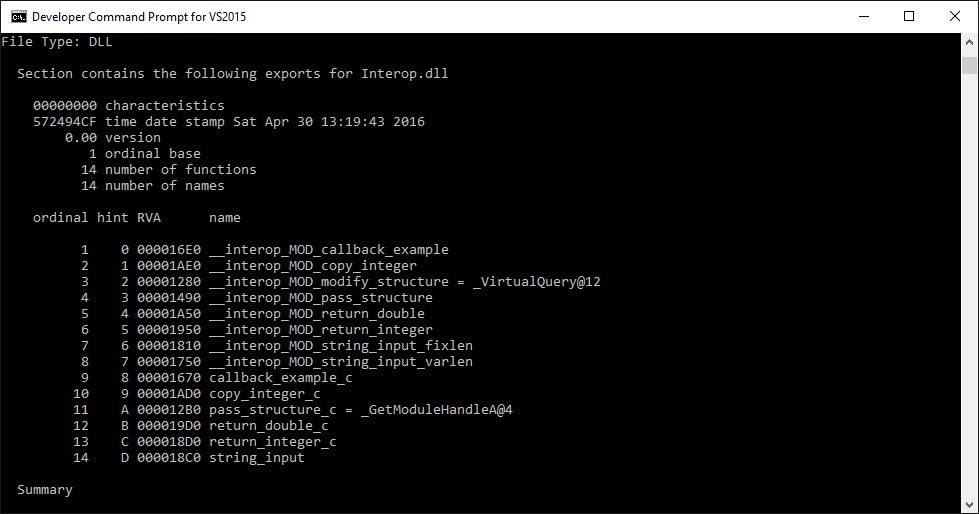
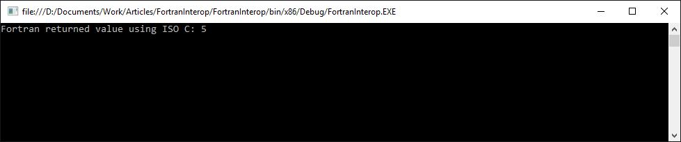

# FORTRAN Interoperability with .NET: Part II - ISO C Binding module

Part II of the FORTRAN Interoperability with .NET series where we introduce the ISO C Binding which greatly simplifies interoperability.

## Introduction

In the previous article we saw how to call a basic Fortran function from the .NET world using C# code. In the 2003 Fortran standard there is a new intrinsic module included which aims to make mixing Fortran with other languages significantly easier. This post will explain how to use the ISO C binding in our use case.

This series aims to introduce some of the concepts of mixed language programming and to serve examples for those who are interested. While in this series the Fortran and C# language are mixed, many of the concepts apply when mixing any set of languages.

1. [Introduction to FORTRAN interopability with .NET](introduction.md)
1. [Exchanging complex data](complex-data.md)
1. [ISO C Binding module](iso-c-binding.md)
1. Callbacks and strings
1. Mixed mode assemblies

So how does one accomplish this interoperability (or interop for short) between different languages? This series will explain what is involved in making Fortran and C# code running on the .NET framework interoperate. It is assumed that the main program is running on the .NET framework; the C# code will call the Fortran code. Callbacks may be involved, but the native Fortran code will never invoke any C# code by itself.

## The ISO C Binding module

Perhaps one of the main conclusions from the first article where I introduced the techniques required for making Fortran and C# code interoperate, is that while it is certainly possible it is not the easiest task to do so. The ISO C Binding module was designed primarily to ease interoperability between programs written in C code and programs written in Fortran code. The ISO C Binding fixes a whole range of issues from calling conventions to name mangling and data types.

In this article each of the issues addressed by the ISO C Binding module are discussed and we'll conclude with an elementary example where the use of the module is demonstrated. The example Fortran function that will be used is the `return_integer` function which simply returns the passed integer to demonstrate the interoperability between C# and Fortran.

### Name mangling

One of the first things which becomes a great deal easier when using the ISO C Binding module is dealing with name mangling. In the previous article a lot of attention was spent on figuring out how function names are mangled and how to ensure that the correct function is called from the .NET code.

When using the ISO C Binding module you essentially no longer have to care about name mangling. Functions are exported under the exact name used to declare them, and you can even directly control the name under which the Fortran function is exported. In the following example the `return_integer` function is modified to take advantage of the ICO C binding:

```fortran
! A simple function demonstrating returning a value using the ISO C binding.
function return_integer_c(input) result(output) bind(C, name='return_integer_c')

    use iso_c_binding

    integer*4, intent(in) :: input
    integer*4 :: output

    write(*,*), "Passed value: ",input
    output = input

end function
```

Note the `bind(C, name='return_integer_c')` which is appended to the function declaration. Using the name argument we can control under which name the function is exported. Compiling the above code and using the Dumpbin.exe on the resulting DLL file utility yields the following result:



Note how at the second to last entry of the export table the `return_integer_c` shows up exactly as how we asked it to be named. I don’t think I’ll need to explain how much easier our life just became.

### Calling convention

A second this that is eased by using the ISO C Binding module is the fixing of the calling convention. Because the ISO C Binding module aims to ease interoperability with C code, the calling convention assumed is the C calling convention (CDECL) in all cases. Again this wipes away the issues we had to endure where we could not leave the calling convention up to chance. This is reflected in the example in the above paragraph where you may note that the following lines were omitted:

```fortran
! Don't leave the calling convention to chance.
!GCC$ ATTRIBUTES CDECL :: return_integer
```

### Data types

An aspect which was not touched upon yet in the previous article and which will see a lot more attention in the next, is passing data back and forward between C# and Fortran. In the elementary example in the previous article it was assumed that the int from C# equals the integer from Fortran. If they wouldn’t and would of different size in memory for example, the stack might get corrupted and all kinds of weird stuff may happen. And yes, this is a very real problem, as the Fortran standard does not explicitly define the in memory size of these data types, only in words. Unfortunately the size of a word and byte do not need to match (but they do in many cases).

Luckily again the ISO C binding module comes to the rescue by declaring Fortran data types which are of fixed value in memory, allowing us to easily match them to whatever other language we are interfacing with. A short overview of these new data types and their matching counterparts in C is given in the table below:

| Fortran type  | Name constant | C type    |
| --------      | -------       | -------   |
| INTEGER       | C_INT	        | int	    |
| INTEGER       | C_LONG        | long int	|
| REAL	        | C_FLOAT       | float	    |
| REAL	        | C_DOUBLE      | double    |
| CHARACTER	    | C_CHAR        | char      |

We are now able to explicity specify that the integers in the Fortran function must be of the standard 4 byte integer size. This is done by declaring the function arguments using `integer(c_int)` as in the following example. Note that we need to indicate the we intend to use declarations from the ISO C Binding module by putting the statement `use iso_c_binding inside` the function declaration.

```fortran
! A simple function demonstrating returning a value using the ISO C binding.
function return_integer_c(input) result(output) bind(C, name='return_integer_c')

    use iso_c_binding

    integer(c_int), intent(in) :: input
    integer(c_int) :: output

    write(*,*), "Passed value: ",input
    output = input

end function
```

More information on the ISO C Binding data types can be found at:

1. http://fortranwiki.org/fortran/show/iso_c_binding
1. https://gcc.gnu.org/onlinedocs/gfortran/ISO_005fC_005fBINDING.html

## Putting the ISO C binding to use

I will now present the full code for the simple Fortran function which returns the passed integer value using the ISO C Binding module and the required C# code to use it from the .NET world.

The main takeaway however is how much easier it is to get this code to work. Overall this code will look very similar to the code presented in the first article. It should get you started writing your own simple mixed language code. More elaborate examples will be discussed later in the series but are already included in the source code attached to this article.

### Fortran Code

We define Fortran module with a simple function which returns the passed integer while leveraging the ISO C Binding module. This code is saved in a file called Interop.f90

```fortran
module INTEROP

    implicit none

    ! A simple function demonstrating returning a value using the ISO C binding.
    function return_integer_c(input) result(output) bind(C, name='return_integer_c')

        use iso_c_binding

        integer(c_int), intent(in) :: input
        integer(c_int) :: output

        write(*,*), "Passed value: ",input
        output = input

    end function

end module
```

### C# .NET code

On the .NET side we need to define the external function using PInvoke. In order to keep code organized this is done in a separate class called FortranInterop. The code looks as follows:

```C#
using System;
using System.Text;
using System.Runtime.InteropServices;

namespace FortranInterop
{
    public class Interop
    {
        public Interop()
        {
        }

        /// <summary>
        /// Returns the passed integer value.
        /// </summary>
        /// <remarks>
        /// External function definition for the simple return_integer_c Fortran function.
        /// Using CDECL calling convention and the function name as specified using the ISO C Binding module.
        /// </remarks>
        /// <param name="input">Integer value to return.</param>
        /// <returns>Returns the input value.</returns>
        [DllImport("Interop.dll", CallingConvention = CallingConvention.Cdecl, EntryPoint = "return_integer_c")]
        public static extern int ReturnIntegerIsoC(ref int input);
        
    }
}
```

Note that we are still using the `[DllImport]` attribute to tell the .NET runtime about the details of this external method. The calling convention is CDECL because we are using the ISO C Binding module on the Fortran side. The entry point simply specifies the normal function name as declared in the Fortran code because name mangling is avoided by the ISO C Binding module.

And finally the code for a very simple console application which makes use of the Fortran function:

```C#
using System;

namespace FortranInterop
{
    class Program
    {
        static void Main(string[] args)
        {

            int value, result;
            value = 5;

            // Pass the input value as a reference. This is required to comply with the Fortran argument
            // passing method.
            result = Interop.ReturnIntegerIsoC(ref value);

            // Output the result and wait for a keystroke.
            Console.WriteLine("Returned value: {0}", result);
            Console.Read();
        }
    }
}
```

### Running the example

Running the example yields the familiar result as shown in the following screenshot:



## Compiling and running Fortran code

The process of compiling and running the Fortran code was covered fairly extensively in the first article in this series. If you are lost on what to do with the example, or are running into issues, I would kindly like to ask you to read the first article.